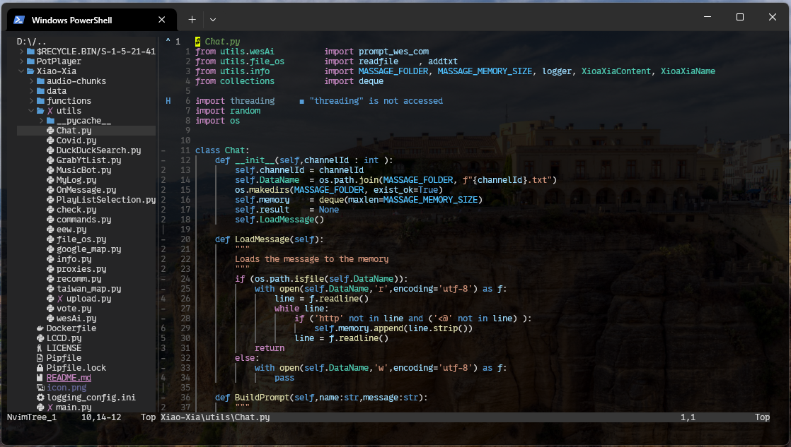
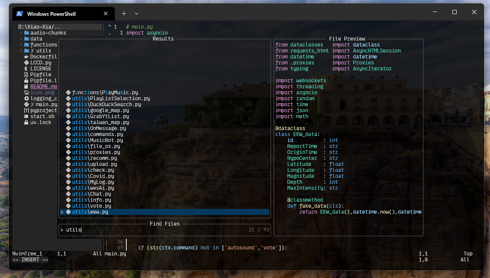
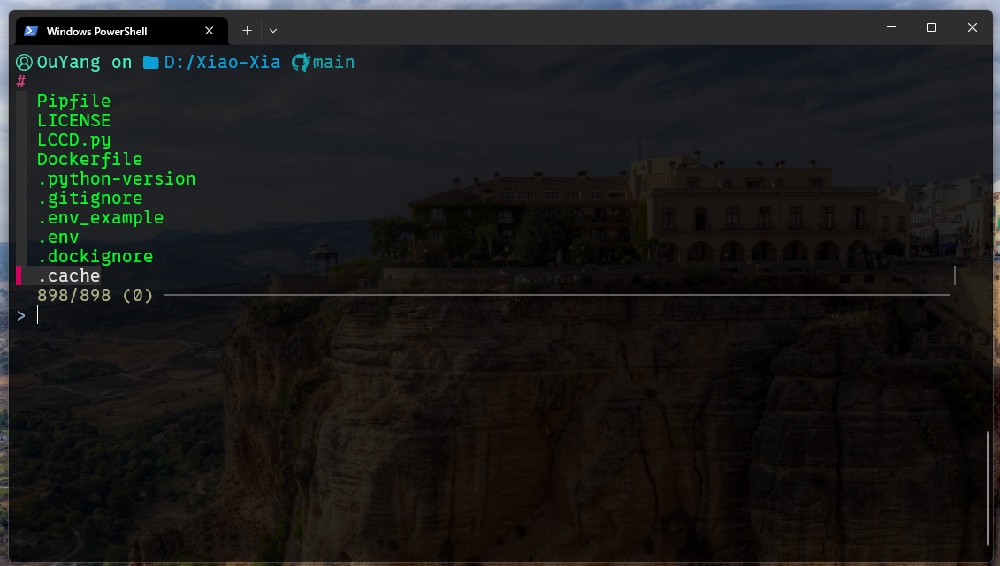
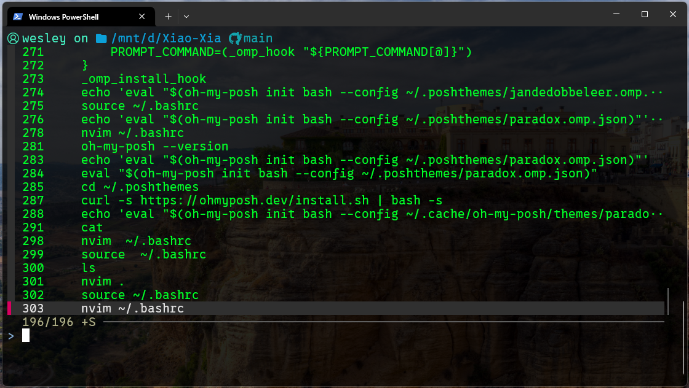
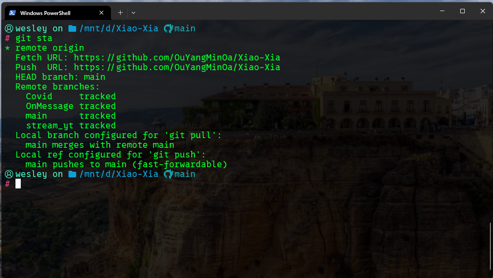

# Example

#### Here is my neovim setup, you can follow the instructions to achieve a similar look.











# Download [neovim](https://neovim.io/)

- for linux

    ```bash
    sudo add-apt-repository ppa:neovim-ppa/unstable
    sudo apt-get update
    sudo apt-get install neovim
    ```

- for window

    [link to download](https://github.com/neovim/neovim/blob/master/INSTALL.md)

# Install [ripgrep](https://github.com/BurntSushi/ripgrep)

- for linux

    ```bash
    sudo apt-get install ripgrep
    ```

- for window

    ```bash
    winget install BurntSushi.ripgrep.MSVC
    ```
# Install [npm](https://www.npmjs.com/)

#### Download [Node.js](https://nodejs.org/zh-tw/download) 

- linux

    ```bash
    curl -o- https://fnm.vercel.app/install | bash
    fnm install 22
    node -v 
    npm -v
    ```

- windows
    ```bash
    winget install Schniz.fnm
    ```
    Reopen the terminal
    ```bash
    fnm install 22
    ```
    Reopen the terminal again, check the installation
    ```bash
    node -v
    npm -v 
    ```
# Install [NerdFont](https://www.nerdfonts.com/font-downloads) for your terminal

- windows terminal
    
    Download and unzip the font ( or download [Cascadia Code NF](https://github.com/microsoft/cascadia-code/releases) here).
    
    1. unzip and right click the font.
    2. Select "Show more options".
    3. Select "Install for all users".
    4. Change the font of your terminal.

- linux
    ```bash
    bash -c "$(curl -fsSL https://raw.githubusercontent.com/officialrajdeepsingh/nerd-fonts-installer/main/install.sh)"
    ```


# Install [gcc](https://gcc.gnu.org/) and uzip

- linux 

    ```bash
    sudo apt install gcc
    sudo apt-get install unzip
    ```

- windows

    open powershell with administrative to install [chocolately](https://chocolatey.org/)
    ```bash
    Set-ExecutionPolicy Bypass -Scope Process -Force; [System.Net.ServicePointManager]::SecurityProtocol = [System.Net.ServicePointManager]::SecurityProtocol -bor 3072; iex ((New-Object System.Net.WebClient).DownloadString('https://community.chocolatey.org/install.ps1'))
    ```
    reopen powershell with administrative and install the [mingw](https://www.mingw-w64.org/)
    ```bash
    choco install mingw
    ```

# Download my neovim config

- for linux

    ```bash
    mkdir ~/.config
    cd ~/.config
    git clone https://github.com/OuYangMinOa/neovim_setup nvim
    ```

- for window

    ```bash
    mkdir ~/.config
    cd ~/AppData/Local
    git clone https://github.com/OuYangMinOa/neovim_setup nvim
    ```

# Open nvim

```bash
nvim .
```

# Install useful toos

* ### [fzf](https://github.com/junegunn/fzf)

    - [windows](https://sathyasays.com/2023/04/11/powershell-fzf-psfzf/)

        ```bash
        git clone --depth 1 https://github.com/junegunn/fzf.git ~/.fzf
        ~/.fzf/install
        ```

        Paste the below command to `~\Documents\WindowsPowerShell\Microsoft.PowerShell_profile.ps1`
        ```
        Set-PsFzfOption -PSReadlineChordProvider 'Ctrl+t' -PSReadlineChordReverseHistory 'Ctrl+r'
        ```
        
    - linux 
        ```bash
        git clone --depth 1 https://github.com/junegunn/fzf.git ~/.fzf
        ~/.fzf/install
        ```

- ### [oh my posh](https://ohmyposh.dev/)

    I'm using `amro`, you can choose your favorite in [here](https://ohmyposh.dev/docs/themes).

    - windows
        ```bash
        winget install JanDeDobbeleer.OhMyPosh -s winget
        oh-my-posh init pwsh --config "$env:POSH_THEMES_PATH\amro.omp.json" | Invoke-Expression
        ```

        Paste the below command to `~\Documents\WindowsPowerShell\Microsoft.PowerShell_profile.ps1`
        ```bash
        oh-my-posh init pwsh --config "$env:POSH_THEMES_PATH\amro.omp.json" | Invoke-Expression
        ```

    - linux 
        ```bash
        curl -s https://ohmyposh.dev/install.sh | bash -s
        export PATH=$PATH:~/.local/bin
        echo 'eval "$(oh-my-posh init bash --config ~/.cache/oh-my-posh/themes/amro.omp.json)"' >> ~/.bashrc
        source ~/.bashrc
        ```

- ### My git config

    ```toml
    [alias]
        st  = status
        poh = push origin head
        co  = checkout
        c   = commit
        cm  = commit -m
        br  = branch
        ca  = "!f(){ git add . \"$1\" && git commit -m 'update'; };f"
        cam = "!f(){ git add . \"$1\" && git commit -m ; };f"
        sta = remote show origin
    [color]  
        diff = auto  
        status = auto  
        branch = auto 
    [branch]  
        autosetuprebase = always

    ```

# Short key

- Swap lines `Alt + up` `Alt+down`

- Comment line `CTRL + /`

- Search words in a file `CTRL + f`

- Search word in a project `CTRL + H`, *required a ripgrep*

- Save `CTRL + s`

- Add `output=` in code ->  `Alt + o`

- Move up down `CTRL + up/downright/left/h/l` (`CTRL + j/k` have another binding)

- Back to last cursor position `Alt + right/left`

- Go to definition `f12`

- Rename variables `f2`

- Fold with level `CTRL + k + 0~4` will fold indent with 0~4 level

- Unfold all `CTRL + k + CTRL + j `

- Fold/unfold this line `zc zr`x

- file tree

    - Toggle file tree `CTRL + b`

    - file tree help `?`

    - expand all `CTRL + Alt + e`

- Toggle terminal `CTRL + \`

- Telescope `CTRL + p`

- Telescope undo tree `Alt + e`

- harpoon add file `Alt + a`

- harpoon show files `ALT + f`

- harpoon move `Alt + ]` or `Alt + [`
